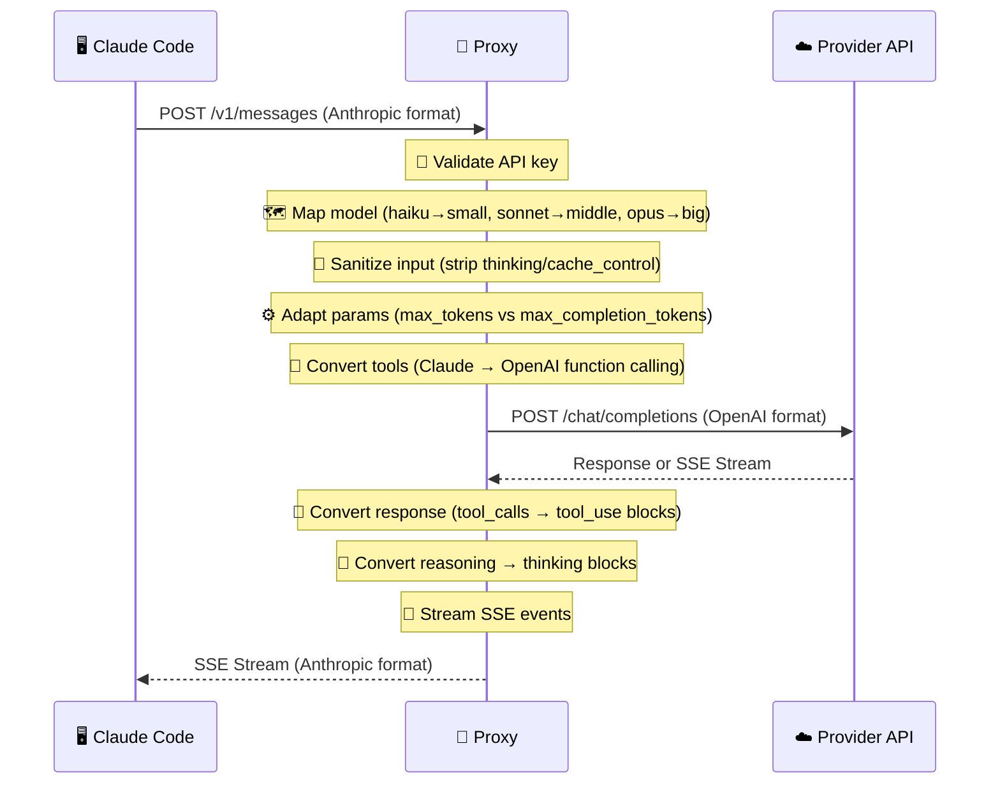
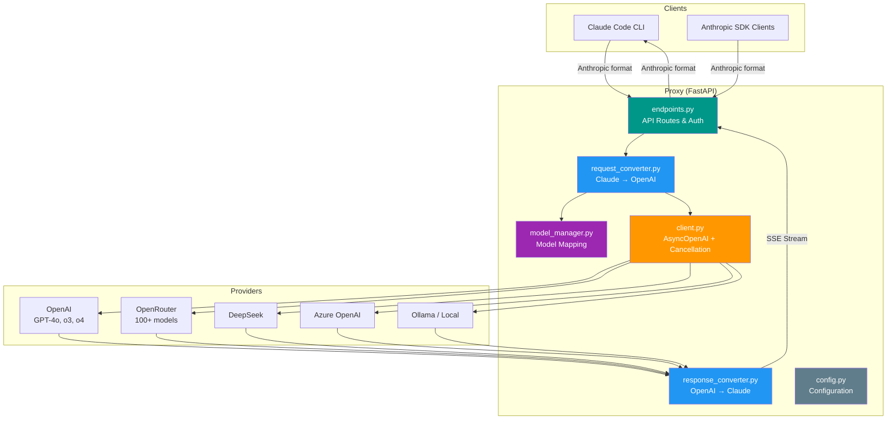

<table style="width:100%" align="center" border="0">
  <tr align="center">
    <td></td>
    <td><h1>🧩 Claude on OpenAI 🔄</h1></td>
  </tr>
</table>

<p align="center">
  <strong>A proxy that lets you use Claude Code with any OpenAI-compatible model — GPT-4o, DeepSeek, OpenRouter, Ollama, and more.</strong>
</p>

<p align="center">
  
  
  
  
  
  
  
</p>

<br>

<p align="center">
  <a href="#bookmark-about">About</a>&nbsp;&nbsp;&nbsp;|&nbsp;&nbsp;&nbsp;
  <a href="#computer-technologies">Technologies</a>&nbsp;&nbsp;&nbsp;|&nbsp;&nbsp;&nbsp;
  <a href="#package-installation">Installation</a>&nbsp;&nbsp;&nbsp;|&nbsp;&nbsp;&nbsp;
  <a href="#rocket-usage">Usage</a>&nbsp;&nbsp;&nbsp;|&nbsp;&nbsp;&nbsp;
  <a href="#gear-how-it-works">How it Works</a>&nbsp;&nbsp;&nbsp;|&nbsp;&nbsp;&nbsp;
  <a href="#globe_with_meridians-providers">Providers</a>&nbsp;&nbsp;&nbsp;|&nbsp;&nbsp;&nbsp;
  <a href="#memo-license">License</a>
</p>

<br>

## :bookmark: About

**Claude on OpenAI** is a proxy server that lets you use Claude Code (Anthropic's CLI tool) with any OpenAI-compatible
API. It translates between Anthropic's API format and OpenAI's format on the fly — supporting GPT-4o, DeepSeek,
OpenRouter (100+ models), Ollama, Azure OpenAI, and any other OpenAI-compatible provider.

### :sparkles: Key Features

- **Multi-provider support** — OpenAI, OpenRouter, DeepSeek, Azure, Ollama, NVIDIA NIM, and more
- **Reasoning/thinking blocks** — o1/o3/o4 `reasoning_content` converted to Claude `thinking` blocks
- **Streaming with tool calls** — Full SSE streaming with incremental tool call argument deltas
- **Input sanitization** — Claude-only fields (`thinking`, `cache_control`) automatically stripped for non-Claude
  providers
- **Adaptive parameters** — Reasoning models get `max_completion_tokens`, others get `max_tokens`
- **Accurate token counting** — Uses `tiktoken` instead of naive char estimation
- **Client disconnection handling** — Cancels upstream requests when client drops
- **Request cancellation** — Thread-safe cancellation with `asyncio.Lock`

<br>

## :computer: Technologies

- **[Python](https://python.org/)** — Core language
- **[FastAPI](https://fastapi.tiangolo.com/)** — Web framework
- **[OpenAI SDK](https://github.com/openai/openai-python)** — Direct async client (no LiteLLM dependency)
- **[Pydantic](https://pydantic-docs.helpmanual.io/)** — Data validation
- **[tiktoken](https://github.com/openai/tiktoken)** — Accurate token counting
- **[Uvicorn](https://www.uvicorn.org/)** — ASGI server

<br>

## :package: Installation

### :gear: **Prerequisites**

- **[Python](https://python.org/)** (3.10+)
- **[uv](https://docs.astral.sh/uv/)** (recommended) or **pip**
- An API key for your chosen provider

<br>

### :octocat: **Cloning the repository**

```sh
git clone https://github.com/gabrielmaialva33/anthropic-proxy.git
cd anthropic-proxy
```

<br>

### :whale: **Installing dependencies**

```sh
# With uv (recommended)
uv venv && uv pip install -r requirements.txt

# Or with pip
pip install -r requirements.txt
```

<br>

### :key: **Configuration**

Copy `.env.example` to `.env` and configure:

```env
# Required: API key for your provider
OPENAI_API_KEY="sk-your-api-key"

# Optional: Base URL (default: https://api.openai.com/v1)
OPENAI_BASE_URL="https://api.openai.com/v1"

# Optional: Model mapping
BIG_MODEL="gpt-4o"            # Claude opus requests
MIDDLE_MODEL="gpt-4o"         # Claude sonnet requests
SMALL_MODEL="gpt-4o-mini"     # Claude haiku requests

# Optional: Client API key validation
ANTHROPIC_API_KEY="expected-key-from-clients"

# Optional: Performance
MAX_TOKENS_LIMIT="16384"
REQUEST_TIMEOUT="120"
```

See [`.env.example`](.env.example) for all options including OpenRouter, DeepSeek, Azure, and Ollama examples.

<br>

## :rocket: Usage

### :computer: **Starting the proxy server**

```sh
# Standard mode
python main.py

# With uvicorn directly
uvicorn src.main:app --host 0.0.0.0 --port 8082

# With auto-reload for development
uvicorn src.main:app --host 0.0.0.0 --port 8082 --reload
```

<br>

### :shell: **Using with Claude Code**

```sh
# Point Claude Code at your proxy
ANTHROPIC_BASE_URL=http://localhost:8082 claude

# Or export for the session
export ANTHROPIC_BASE_URL=http://localhost:8082
claude "Write a Python function that counts words"
```

That's it! Claude Code will use your configured model through the proxy.

<br>

### :wrench: **Troubleshooting**

- **Connection refused** — Check the proxy is running on port 8082
- **Authentication errors** — Verify your `OPENAI_API_KEY` is correct
- **Model not found** — Check your `BIG_MODEL`/`SMALL_MODEL` values match your provider
- **Max token errors** — Increase `MAX_TOKENS_LIMIT` in `.env`

<br>

## :gear: How it Works

### Request Flow



### Architecture Overview



### Streaming Event Flow


The proxy handles streaming and non-streaming responses, tool calls, system prompts, multi-turn conversations,
images, and reasoning/thinking blocks.

<br>

## :globe_with_meridians: Providers

### OpenAI (default)

```env
OPENAI_API_KEY="sk-..."
BIG_MODEL="gpt-4o"
SMALL_MODEL="gpt-4o-mini"
```

### OpenRouter (100+ models)

```env
OPENAI_API_KEY="sk-or-v1-..."
OPENAI_BASE_URL="https://openrouter.ai/api/v1"
BIG_MODEL="anthropic/claude-3.5-sonnet"
SMALL_MODEL="meta-llama/llama-3.1-8b-instruct:free"
```

### DeepSeek

```env
OPENAI_API_KEY="sk-..."
OPENAI_BASE_URL="https://api.deepseek.com/v1"
BIG_MODEL="deepseek-chat"
SMALL_MODEL="deepseek-chat"
```

### Azure OpenAI

```env
OPENAI_API_KEY="your-azure-key"
OPENAI_BASE_URL="https://your-resource.openai.azure.com/openai/deployments/your-deployment"
AZURE_API_VERSION="2024-03-01-preview"
```

### Ollama / Local Models

```env
OPENAI_API_KEY="not-needed"
OPENAI_BASE_URL="http://localhost:11434/v1"
BIG_MODEL="llama3.1:70b"
SMALL_MODEL="llama3.1:8b"
```

### OpenAI Reasoning Models (o1/o3/o4)

```env
BIG_MODEL="o3-mini"
SMALL_MODEL="o4-mini"
# Automatically uses max_completion_tokens and converts thinking blocks
```

<br>

### :world_map: Model Mapping

| Claude Model | Maps to         | Config          |
|--------------|-----------------|-----------------|
| haiku        | gpt-4o-mini     | `SMALL_MODEL`   |
| sonnet       | gpt-4o          | `MIDDLE_MODEL`  |
| opus         | gpt-4o          | `BIG_MODEL`     |
| (other)      | passthrough     | —               |

Models with provider prefixes (`meta/`, `google/`, `openrouter/`, etc.) are passed through without remapping.

<br>

## :test_tube: Running Tests

```sh
# Run all tests
python -m tests.test_api

# Run only non-streaming tests
python -m tests.test_api --no-streaming

# Run only simple tests (no tools)
python -m tests.test_api --simple

# Run only tool tests
python -m tests.test_api --tools-only

# Run unit tests for the converter
python -m tests.test_converter
```

<br>

## :memo: License

This project is under the **MIT** license. [MIT](./LICENSE) ❤️

<br>

## :rocket: **Contributors**

| [](https://github.com/gabrielmaialva33) |
|-----------------------------------------------------------------------------------------------------------|
| [Maia](https://github.com/gabrielmaialva33)                                                               |

Made with ❤️ by Maia 👋🏽 [Get in touch!](https://t.me/mrootx)

## :star:

Liked it? Leave a little star to help the project ⭐

<br/>

<p align="center"></p>
<p align="center">&copy; 2024-present <a href="https://github.com/gabrielmaialva33/" target="_blank">Maia</a></p>
